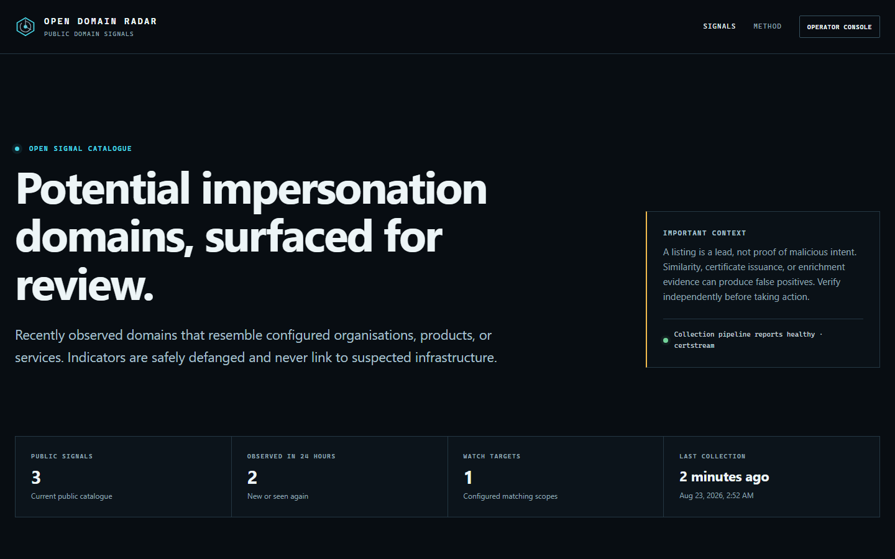
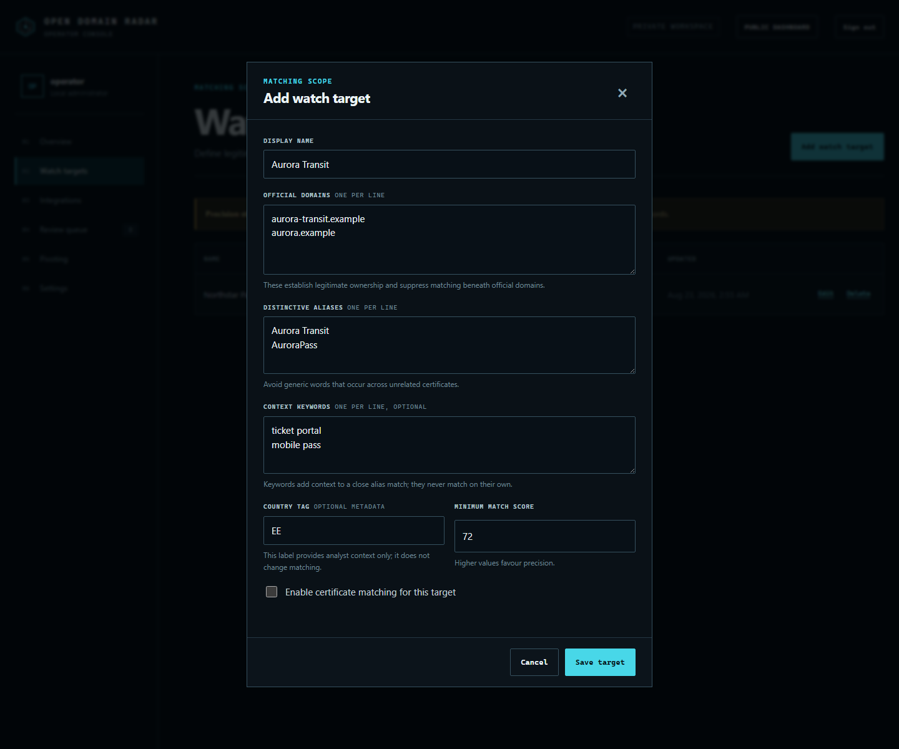
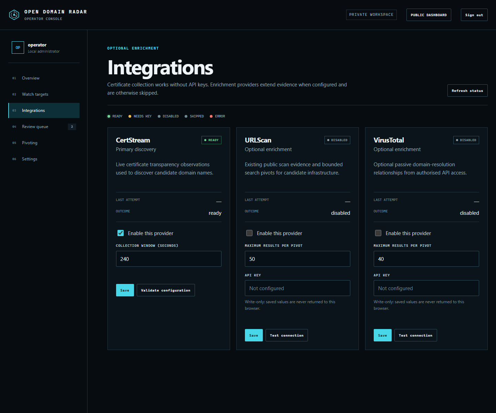
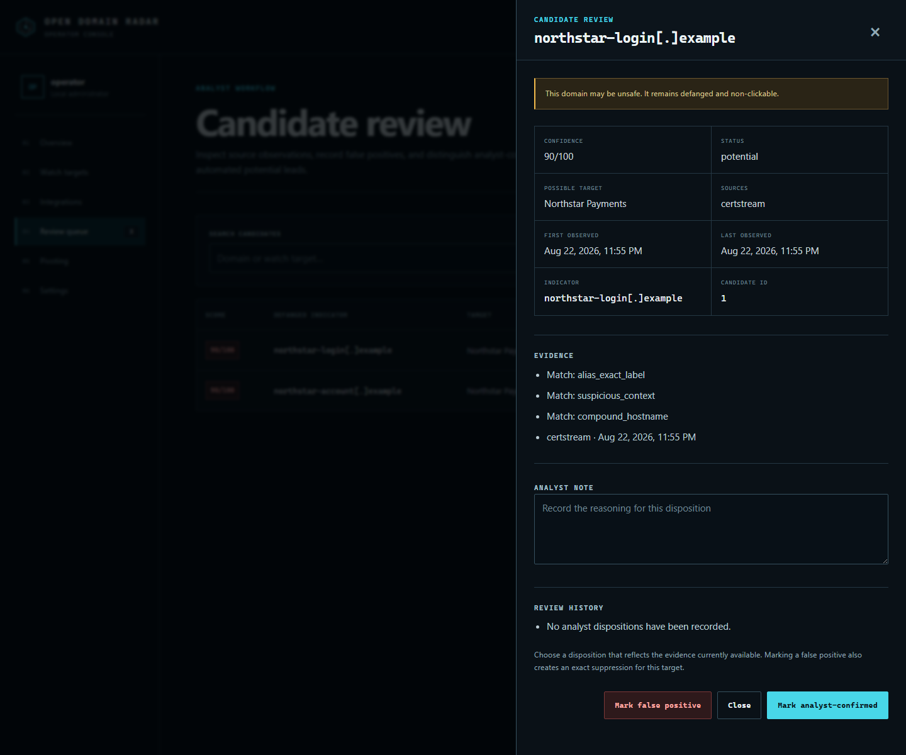

# Open Domain Radar

[](https://github.com/Hecavex/open-domain-radar/actions/workflows/ci.yml)
[](LICENSE)
[](pyproject.toml)

A self-hosted Python application for collecting, matching, reviewing and safely publishing potential domain-impersonation signals.

Open Domain Radar combines live Certificate Transparency discovery, optional passive enrichment, an analyst review trail and a public read-only dashboard. It is a candidate system, not an automated phishing-verdict engine.



*The anonymous dashboard publishes defanged candidates, collection health and evidence boundaries without exposing the operator console or provider credentials.*

> **Alpha software:** deploy it as a small single-node research service and review its operating limits. Database changes are forward-only and pre-1.0 releases may require an operator-tested migration.

## What it provides

- keyless, bounded CertStream collection;
- conservative matching against operator-defined identities and official domains;
- optional URLScan search and VirusTotal passive-resolution enrichment;
- persistent SQLite/WAL storage for observations, candidates, pivots and review events;
- a protected single-operator console for targets, integrations, triage and suppressions;
- an anonymous dashboard with defanged, non-clickable indicators;
- encrypted, write-only provider secrets and CSRF-protected sessions; and
- native Python and Docker Compose deployment without a Node.js runtime.

The project does **not** actively visit candidate websites, submit URLs for scanning, replay CertStream downtime, make automatic maliciousness claims, provide takedown or alerting SLAs, support multiple operators, or run on GitHub Pages.

No production registry, proprietary rules, historical observations, credentials or real indicators are included.

## Data flow

```text
CertStream
    |
    v
normalize domain -> suppress official properties -> match one watch target
                                                    |
                                                    v
                                         store public potential lead
                                                    |
                          +-------------------------+-------------------------+
                          |                                                   |
                          v                                                   v
              optional URLScan / VirusTotal                         analyst review
                   passive enrichment                         confirm / close / suppress
                          |                                                   |
                          +-------------------------+-------------------------+
                                                    |
                                                    v
                                      defanged public dashboard
```

Optional providers enrich a candidate; they are never a publication gate. CertStream matches are retained even when no API key is configured.

## Quick start with Docker Compose

Requirements: Git, Docker Engine and Docker Compose.

```sh
git clone https://github.com/Hecavex/open-domain-radar.git
cd open-domain-radar
docker compose build
docker compose run --rm web open-domain-radar init
docker compose run --rm web open-domain-radar create-admin --username operator
docker compose up -d
```

Open:

- public dashboard: <http://127.0.0.1:8787/>
- operator console: <http://127.0.0.1:8787/admin>

The supplied Compose configuration binds to loopback. It starts one web process and one worker against the same private SQLite volume.

## First-run walkthrough

### 1. Define what you are protecting

Go to **Operator console → 02 Watch targets → Add watch target**.



Fill the form in this order:

1. **Display name** — the organisation, service or product shown to analysts.
2. **Official domains** — every legitimate domain under any TLD, one per line. These are suppressed before matching.
3. **Distinctive aliases** — names or abbreviations that are specific enough to survive Certificate Transparency noise.
4. **Context keywords** — optional supporting terms such as a distinctive portal or service name; they never match alone.
5. **Country tag** — optional two-letter analyst metadata. It does not affect matching.
6. **Minimum match score** — raise it to favour precision; lower it only after reviewing missed cases.
7. **Enable certificate matching** — enable only after the official-domain and alias lists are correct.

Click **Save target**. Avoid generic aliases such as “bank”, “pay”, or “login”; broad terms create broad false positives.

### 2. Configure collection and optional enrichment

Go to **Operator console → 03 Integrations**.



- **CertStream** needs no key. Choose a collection window from 5 to 900 seconds, click **Save**, then **Validate configuration**.
- **URLScan** is optional. It searches existing public reports by exact domain; it does not submit the domain.
- **VirusTotal** is optional. It retrieves bounded passive domain-resolution relationships permitted by the operator's API tier.

For URLScan or VirusTotal, enable the card, paste the key, set the result limit, click **Save**, then **Test connection**. Stored keys are write-only. Environment keys override stored keys and require both processes to restart.

Collection runs only while the worker is running. Docker Compose starts it automatically. A native installation must run `open-domain-radar worker` in a second terminal.

### 3. Review and correct candidates

Go to **Operator console → 04 Review queue → Review**.



Inspect the target, score, matching reasons, source observations and review history. Then record a note and choose a disposition:

| State | Public | Meaning |
| --- | --- | --- |
| `potential` | Yes | Automated candidate awaiting analyst assessment |
| `published` | Yes | Analyst-confirmed signal |
| `false_positive` | No | Incorrect candidate; an exact target-scoped suppression is created |
| `closed` | No | Removed from public view without asserting it was a false positive |

**Restore to review** disables the linked false-positive suppression and returns an eligible record to `potential`. Observations and review events remain append-only.

### 4. Add a manual suppression when necessary

Go to **Operator console → 06 Settings → Suppressions**.

Enter a domain or pattern, select **exact**, **suffix**, or **glob**, choose a target scope or global scope, explain the reason, then click **Add suppression**. Prefer exact, target-scoped rules. Broad global rules can silently hide unrelated candidates.

### 5. Queue a passive pivot

Go to **Operator console → 05 Pivoting**. Enter a domain that independently matches exactly one enabled watch target, select URLScan and/or VirusTotal, add an optional note, then click **Queue pivot**.

The worker processes the queue. Disabled providers and providers without usable keys are skipped; provider results do not recursively create more pivot jobs.

## Native Python installation

Requirements: Python 3.12 or later.

### Windows PowerShell

```powershell
python -m venv .venv
.\.venv\Scripts\python -m pip install .
.\.venv\Scripts\open-domain-radar init
.\.venv\Scripts\open-domain-radar create-admin --username operator
.\.venv\Scripts\open-domain-radar serve
```

Start the worker in a second terminal:

```powershell
.\.venv\Scripts\open-domain-radar worker
```

### Linux or macOS

```sh
python3 -m venv .venv
.venv/bin/python -m pip install .
.venv/bin/open-domain-radar init
.venv/bin/open-domain-radar create-admin --username operator
.venv/bin/open-domain-radar serve
```

Start the worker in a second terminal:

```sh
.venv/bin/open-domain-radar worker
```

Browser-based account creation is deliberately unavailable. Create the single operator from a trusted terminal before exposing the service.

## Credentials and configuration

Copy [`.env.example`](.env.example) only when you need environment-based configuration. Never commit the resulting `.env` file.

| Variable | Required | Purpose |
| --- | --- | --- |
| `ODR_DATA_DIR` | No | Private state directory; defaults to `.state` |
| `ODR_PUBLIC_ORIGIN` | For remote use | Exact external HTTPS origin |
| `ODR_MASTER_KEY` | Recommended for deployment | Encrypts stored provider credentials |
| `URLSCAN_API_KEY` | No | Optional URLScan enrichment |
| `VIRUSTOTAL_API_KEY` | No | Optional VirusTotal enrichment |

The web process and worker must receive the same secret configuration. Missing optional keys are a normal state and never stop CertStream candidates from being stored.

## Operating boundaries

- Supported topology: one web process, one worker and one SQLite/WAL database.
- CertStream is a live feed. Bounded listening windows cannot replay missed time and are not daily global snapshots.
- Automated `potential` records are public by design; `false_positive` and `closed` records are private.
- Candidate domains are normalized, defanged and rendered as text rather than links.
- Keep `/admin` behind HTTPS and preferably a VPN or IP allowlist for remote deployments.
- Back up the database and master key separately.

Create a consistent database backup with:

```sh
open-domain-radar backup --output backups/radar.sqlite3
```

Test the backup on a stopped, disconnected instance:

```sh
open-domain-radar restore backups/radar.sqlite3
open-domain-radar init
```

Replacing an existing database requires `--force`. The restore command validates SQLite integrity and schema compatibility, then saves the current database beside it as a timestamped `before-restore` rollback copy before atomically replacing it. Stop both the web and worker processes first. The master key is intentionally not part of a database backup.

The schema is tracked in a forward-only migration ledger. A database newer than the running application is rejected instead of being downgraded silently. See [Operations and backup](docs/OPERATIONS.md) for the complete rehearsal and rollback procedure.

## Development

```sh
python -m pip install -e ".[dev]"
python -m playwright install chromium
python -m ruff check .
python -m ruff format --check .
python -m mypy
python -m pytest --cov=open_domain_radar --cov-report=term-missing
```

The release suite also exercises packaged assets, responsive layouts, keyboard focus, forced-colour behavior, reflow, backup/restore and local TLS reverse-proxy operation. Live external-link reachability is intentionally opt-in:

```sh
ODR_CHECK_EXTERNAL_LINKS=1 python -m pytest tests/test_documentation_links.py
```

Tests use reserved domains and mocked providers. Do not add real suspicious infrastructure, provider credentials or analyst data to fixtures or documentation images.

## Documentation

- [Architecture and data flow](docs/ARCHITECTURE.md)
- [Detection and scoring](docs/DETECTION.md)
- [Providers and bounded pivots](docs/PROVIDERS.md)
- [Deployment](docs/DEPLOYMENT.md)
- [Operations and backup](docs/OPERATIONS.md)
- [Security model](docs/SECURITY-MODEL.md)
- [Public API data contract](docs/DATA-CONTRACT.md)
- [Release qualification and rehearsal](docs/RELEASE-REHEARSAL.md)

See [CONTRIBUTING.md](CONTRIBUTING.md) before proposing detection, provider, schema or authentication changes. Report security issues through the process in [SECURITY.md](SECURITY.md).

## Licence and data terms

The software is licensed under Apache-2.0. Synthetic test and documentation material is offered under CC0-1.0. Provider results, screenshots and other third-party data remain subject to their original terms; see [DATA-LICENSE.md](DATA-LICENSE.md) and [THIRD-PARTY-NOTICES.md](THIRD-PARTY-NOTICES.md).
